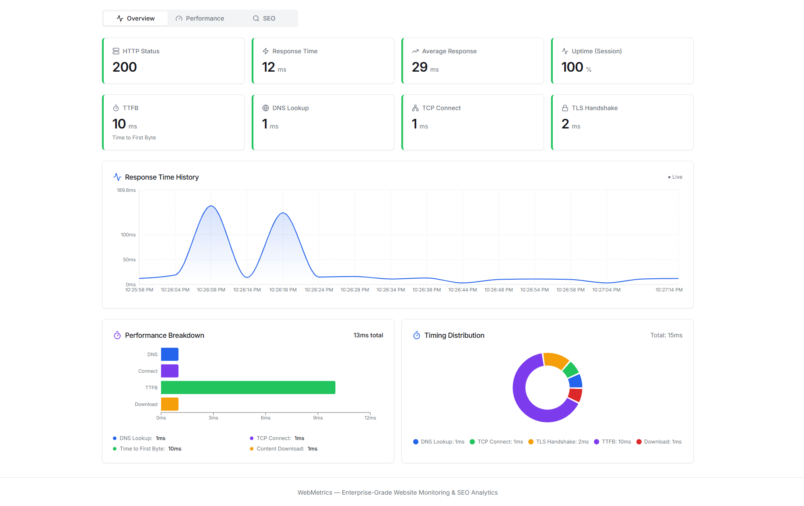
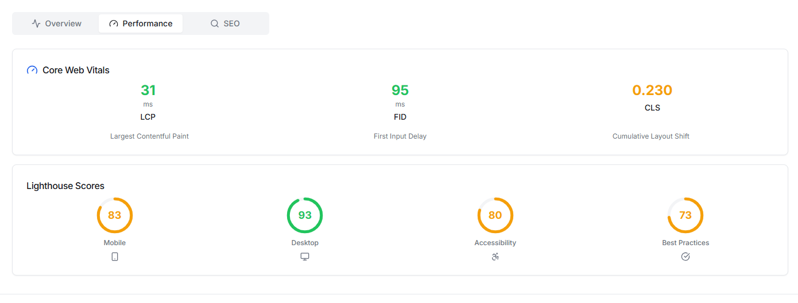
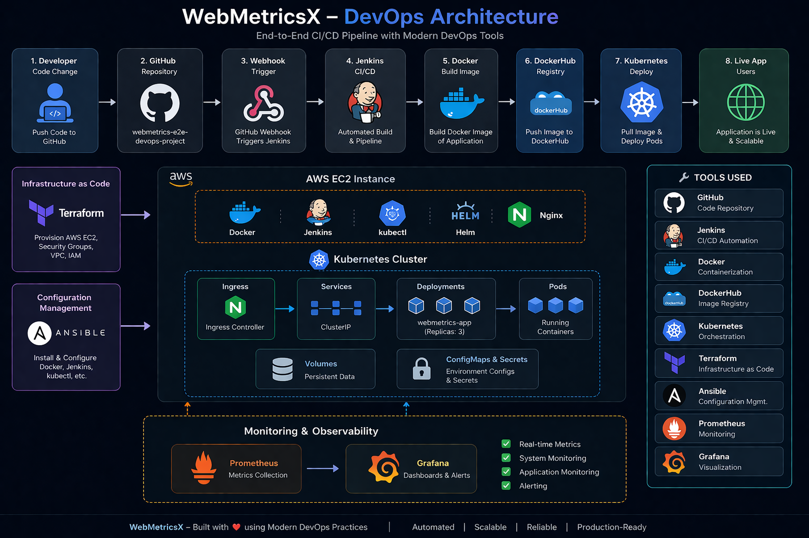

# 🚀 WebMetricsX

### 📊 Real-Time Website Monitoring + 🔥 DevOps Powered Deployment

WebMetricsX is a **production-ready, enterprise-grade full-stack + DevOps application** that provides **REAL-TIME website monitoring, SEO analytics, and automated CI/CD deployment**.

It delivers **accurate, continuously updating insights every 5 seconds** using **real APIs, live network requests, and automated pipelines**.

---

## 🌐 Key Highlights

* ⚡ Real-time monitoring (updates every 5 seconds)
* 🌐 Live uptime & website health tracking
* 📈 Advanced performance analytics
* 🔍 Professional SEO audits
* 📊 Interactive charts & dashboards
* 📄 Export analytics as PDF
* 📱 Fully responsive UI
* 🚀 Automated CI/CD deployment
* ❌ No fake data — real APIs only

---

## 🧠 How WebMetrics Works

```
User → Paste URL → Monitoring Engine → Live Dashboard → PDF Export
```

---

## 📸 Application Screenshots

### 📊 Dashboard



---

### 📈 Performance Metrics



---

### 🔍 SEO Analysis


---

### 📄 Exported Reports


---

## 🏗️ System Architecture

```
Frontend (React)
↓
Backend (Node.js)
↓
Monitoring Engine
↓
External APIs (SEO / Performance)
```

---

## 🔍 Core Features

* Website uptime monitoring
* HTTP response tracking
* DNS / TLS / TTFB analysis
* Core Web Vitals tracking
* SEO audit system
* Performance insights
* Error detection
* Real-time charts

---

# ⚙️ DevOps Architecture (🔥 Highlight)

```
Developer → GitHub → Webhook → Jenkins → Docker → DockerHub → Kubernetes → Live 🚀
```

---

## 📸 DevOps Architecture



---

# 🚀 CI/CD Pipeline (Jenkins)

### Automated Flow:

```
Git Push →
Webhook Trigger →
Jenkins Pipeline →
Docker Build →
Docker Push →
Kubernetes Deploy 🚀
```

---

## 📸 Jenkins Pipeline

👉 *(Add Jenkins pipeline screenshot here)*

---

# 🐳 Docker (Containerization)

* Application containerized using Docker
* Images built dynamically in Jenkins
* Stored in DockerHub

## 📸 Docker Build & Push

👉 *(Add docker build screenshot here)*

---

# ☸️ Kubernetes Deployment

* Deployment & Service configured
* Scalable pods
* Load balancing enabled

## 📸 Kubernetes Pods

👉 *(Add kubectl pods screenshot here)*

## 📸 Kubernetes Services

👉 *(Add service screenshot here)*

---

# ☁️ Infrastructure as Code (Terraform)

* EC2 instance provisioning automated
* Security groups configured
* Fully reproducible infrastructure

## 📸 Terraform Output

👉 *(Add terraform apply screenshot here)*

---

# 🤖 Configuration Management (Ansible)

* Automated installation of:

  * Docker
  * Jenkins
  * kubectl
* Complete server setup automation

## 📸 Ansible Execution

👉 *(Add ansible output screenshot here)*

---

# 📊 Monitoring (Prometheus + Grafana)

* Real-time metrics collection
* Visual dashboards
* Performance monitoring

## 📸 Grafana Dashboard

👉 *(Add grafana dashboard screenshot here)*

## 📸 Prometheus Metrics

👉 *(Add prometheus UI screenshot here)*

---

# ⚡ Tech Stack

### Frontend

* React.js
* Tailwind CSS
* Chart.js / Recharts

### Backend

* Node.js
* Express.js

### DevOps

* Docker
* Kubernetes
* Jenkins
* Terraform
* Ansible
* AWS EC2
* Prometheus + Grafana

---

# 🔧 Setup Instructions

```bash
git clone https://github.com/Saurav6200907210/webmetrics-e2e-devops-project.git
cd webmetrics
npm install
npm run dev
```

---

# 🎯 Achievements

* 🔥 Built end-to-end CI/CD pipeline
* 🚀 Automated deployment using Jenkins + Webhooks
* ☁️ Infrastructure automated with Terraform
* 🤖 Server setup automated using Ansible
* 🐳 Dockerized application
* ☸️ Deployed on Kubernetes
* 📊 Integrated monitoring (Grafana + Prometheus)

---

# 💼 Resume Line (🔥)

👉 Built an end-to-end DevOps pipeline using **Jenkins, Docker, Kubernetes, Terraform, and Ansible** with automated deployment on AWS.

---

# 🧠 Final Thought

> 🚀 WebMetricsX demonstrates real-world DevOps practices including automation, scalability, monitoring, and production deployment.

---

# ⭐ Support

If you like this project, give it a ⭐ on GitHub!
